# Smartphone
This dataset is about smartphones 

I took a dataset of smartphone from kaggle 
here is the link for that - https://www.kaggle.com/datasets/abhijitdahatonde/real-world-smartphones-dataset
I created it into two dataset table - Fact table and dimentional table - 
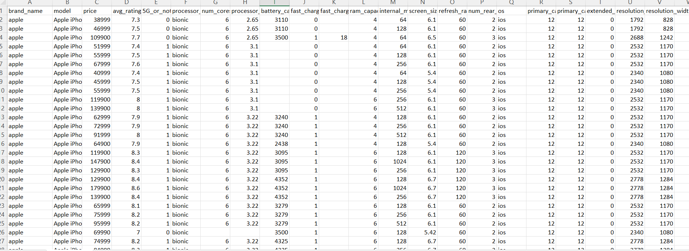

I cleaned the data and then I upload both the dataset on Mysql 

fact table

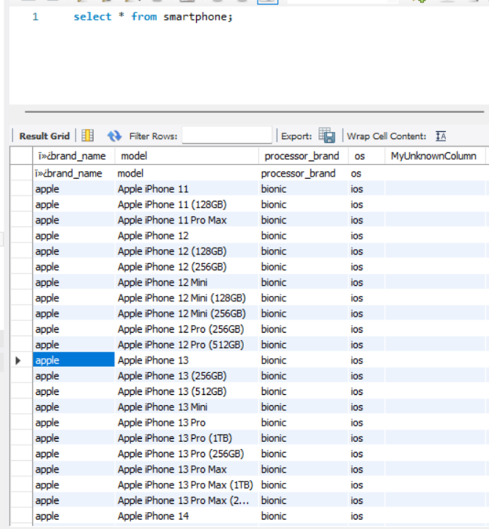

Dimentional table 

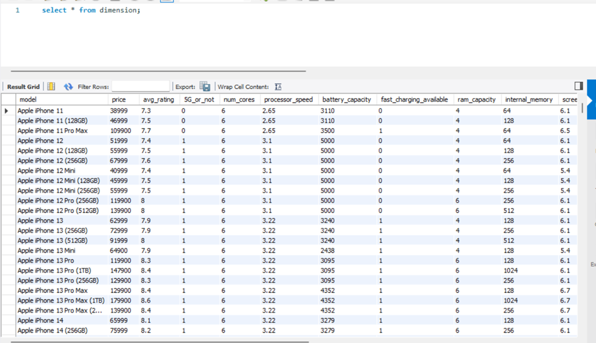

Now,
it is important to ensure the data quality. We can start by checking for missing or inconsistent data.

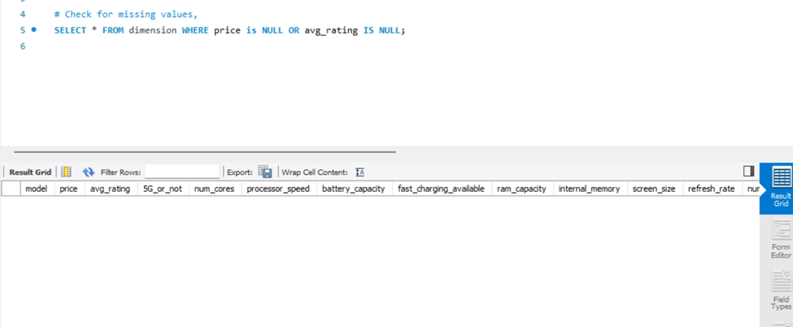

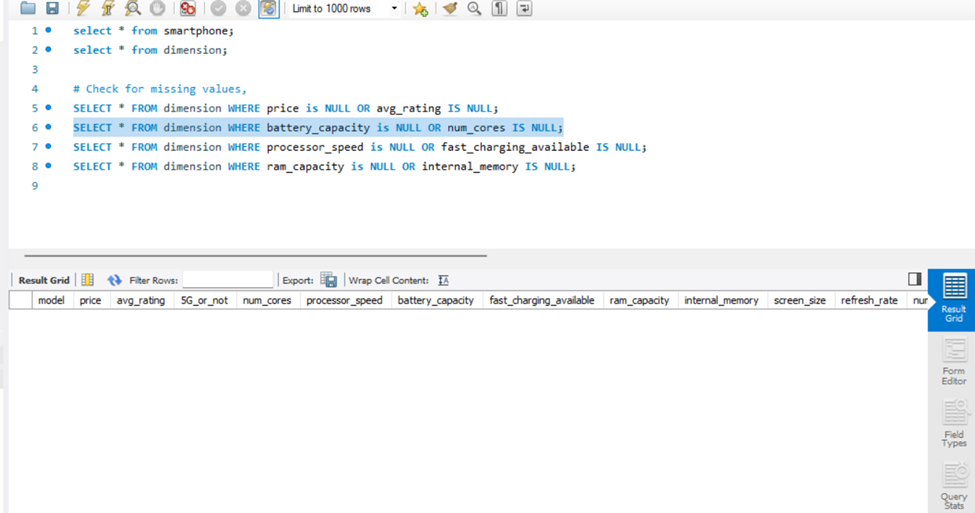

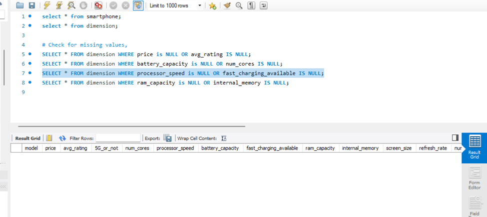

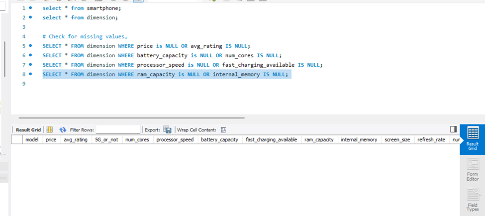

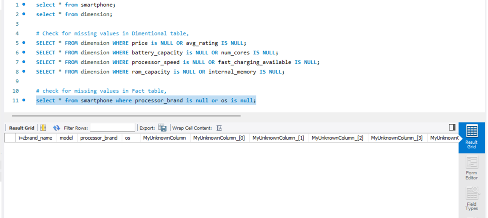

Now, I am going to apply transformations to the data. We'll perform an aggregation operation (GROUP BY) and a JOIN operation to showcase both concepts.

1. Aggregation operation ( GROUP BY)

This query performs an aggregation operation on the dimension table. The purpose of this query is to calculate the average price (avg_price) for products grouped by their average rating (avg_rating).

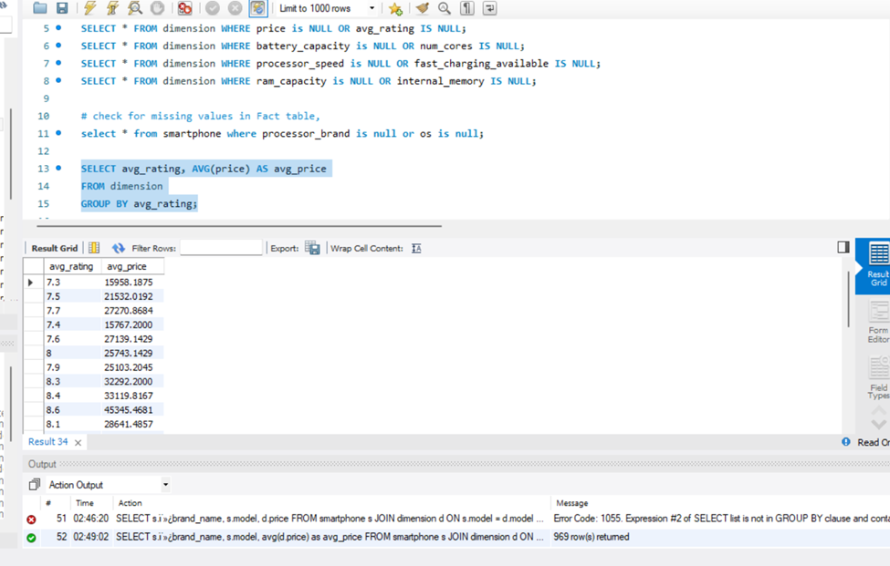

The result of this query shows the average price of products for each unique avg_rating value in the dimension table.

This query performs a similar aggregation operation, but this time it calculates the average price (avg_price) for products grouped by their RAM capacity (ram_capacity).

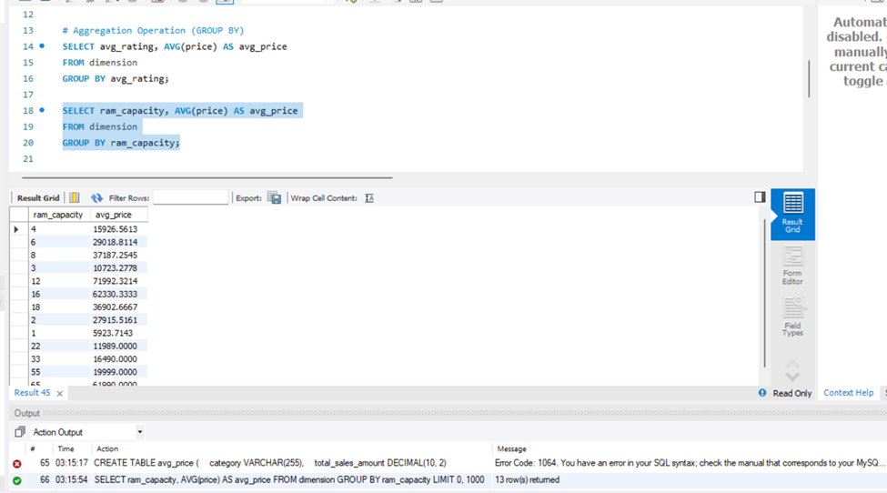

The result of this query shows the average price of products for each unique ram_capacity value in the dimension table.
In both of these queries, the "GROUP BY" part is really important. It's like sorting things based on a specific characteristic. This helps us look at groups of similar things and find out the average price for each group. So, we can see how different things with similar features are priced on average. It helps us understand how certain qualities affect the average price of products.

2. Join opreation 
A join operation between two tables, smartphone and dimension, and then calculates the average price of smartphones for each brand

 The code retrieves information from two tables, smartphone and dimension, joins them based on the model column, groups the data by brand_name, and calculates the average price for each brand. This query provides insights into how different smartphone brands are priced on average based on the data stored in the two tables. The unusual characters in s.brand_name might be due to an encoding issue or special characters in the column name; you may want to verify and correct the column name if needed.

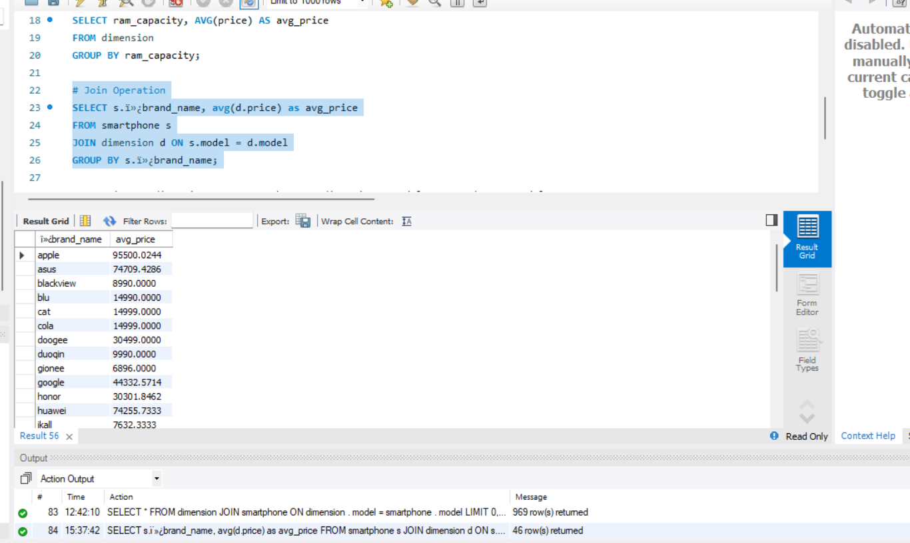

This SQL code performs a JOIN operation between two tables, dimension and smartphone, using the model column as the common field for joining.

this query retrieves all columns from the combined result of the dimension and smartphone tables where the model values match. It essentially combines information about smartphones from the dimension table with information about smartphones from the "smartphone" table based on their common model values.

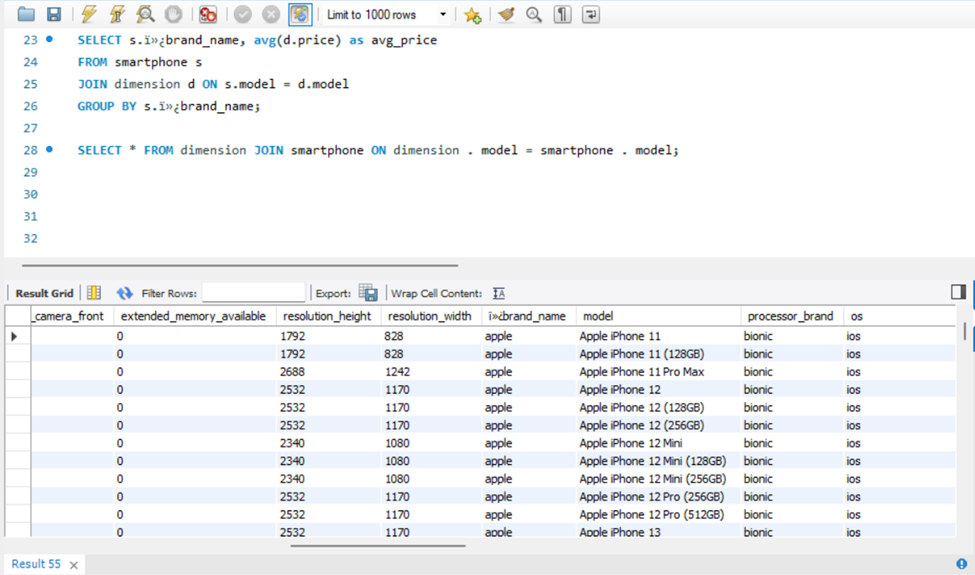

 

